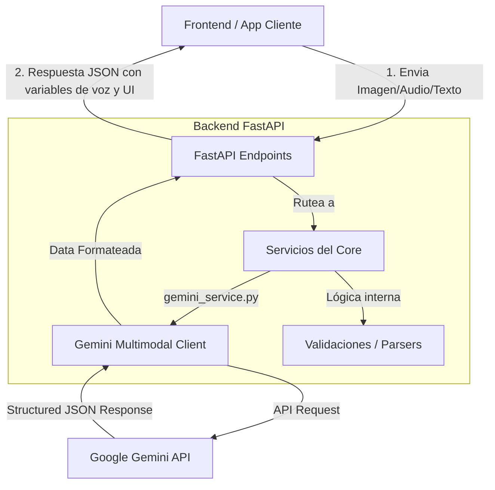

# Arquitectura del Sistema - PharmaVox Backend 🏛️🔌

Este documento describe la arquitectura interna, los flujos de datos y las integraciones del backend de PharmaVox.

---

## 🗺️ Diagrama de Flujo del Sistema

El backend actúa como un orquestador que toma entradas multimodales (imágenes de medicamentos, audio o texto de consultas del usuario), las procesa mediante modelos generativos y APIs de IA, y las retorna al frontend en formatos estructurados y listos para accesibilidad.

---

## 🧠 Integración con Google Gemini (Modelos Multimodales)

PharmaVox aprovecha el poder de la API de **Google Gemini** para realizar tareas que tradicionalmente requerían múltiples modelos especializados:

1.  **Visión por Computadora (OCR + Entendimiento Contextual):**
    *   En lugar de usar un OCR tradicional plano que solo extrae texto desorganizado de una caja de medicamento curvada o brillante, enviamos la imagen del medicamento directamente a **Gemini** con un prompt de sistema estricto.
    *   Gemini identifica el medicamento, extrae la información relevante y descarta el ruido visual de manera automática.

2.  **Esquemas Estructurados Rígidos (Structured Outputs):**
    *   Para garantizar que la API del backend retorne respuestas predecibles y seguras, utilizamos el soporte de **Esquemas JSON** de Gemini.
    *   Definimos un esquema estricto (utilizando tipos de datos Pydantic) y forzamos a Gemini a responder bajo esa exacta estructura, evitando alucinaciones o formatos inválidos.

---

## 🎙️💻 Modelo de Presentación Híbrido (Voz + Interfaz Visual)

El backend de PharmaVox está especialmente diseñado para dar soporte a una **experiencia dual (multimodal)** en dispositivos de escritorio y computadores:

1.  **Respuestas en "Lenguaje Hablado" (Vox Engine):** La API de chat conversacional `/api/v1/ask` estructura un campo específico llamado `voice_response`. Este contiene frases redactadas fonéticamente y optimizadas para lectores de pantalla o síntesis de voz, evitando leer códigos raros o términos que suenen poco naturales al hablar.
2.  **Estructura Visual de Datos (Visual Desktop Component):** Para aprovechar las pantallas de los computadores, el backend asocia a cada respuesta por voz un conjunto de metadatos visuales (`visual_layout`). Este contiene tarjetas informativas, listados estructurados, íconos semánticos y estados de alerta codificados en JSON. Esto permite que el frontend dibuje interfaces ricas, limpias y legibles al mismo tiempo que el usuario escucha la voz.

---

## 📂 Organización y Diseño Modular

La estructura del código sigue el patrón de **Arquitectura Limpia**, separando las responsabilidades claramente:

*   `app/core/`: Centraliza las configuraciones globales, secretos y variables de entorno utilizando Pydantic Settings.
*   `app/api/`: Capa de transporte y enrutamiento. Valida las peticiones HTTP entrantes mediante esquemas de Pydantic.
*   `app/schemas/`: Define las estructuras de datos (tanto de entrada como de salida), garantizando que el contrato de la API sea inmutable.
*   `app/services/`: Capa encargada de la comunicación con servicios de terceros. Aquí reside el cliente de Gemini y las llamadas de IA.
