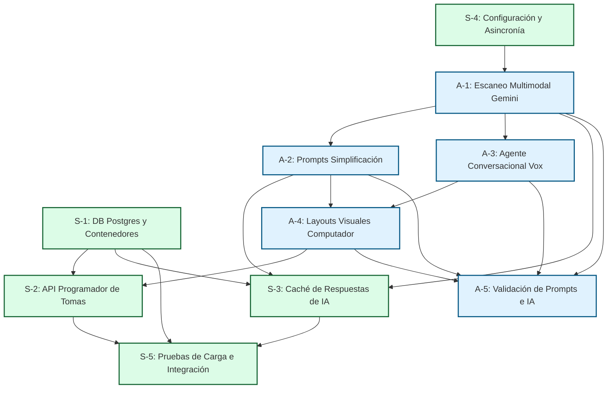

# Asignación de Tareas y Roles del Equipo - PharmaVox Backend 👥🛠️

Para asegurar el éxito del proyecto PharmaVox, el desarrollo del backend se divide de manera equitativa entre **Sergio** (Infraestructura, Base de Datos y Rendimiento) y **Alejandro** (Integración de IA, Agente de Voz y Multimodalidad), con un plan estructurado de **10 tareas clave (5 por persona)**.

---

## 👥 Resumen de Roles y Responsabilidades

*   **Sergio (Database & Infrastructure Lead):** Encargado de estructurar la persistencia de datos (historial de escaneos, agendas y tomas), optimizar la velocidad y latencia mediante caché, garantizar la asincronía asfáltica y configurar la seguridad e infraestructura del servidor de FastAPI.
*   **Alejandro (AI & Speech Integration Lead):** Encargado de orquestar la comunicación con la API de Google Gemini (modelos multimodales para escaneo de recetas y cajas), estructurar prompts para la simplificación interactiva de textos médicos y diseñar el formateador de respuestas por voz y layouts para computador.

---

## 🕸️ Diagrama de Dependencia de Tareas

Para optimizar los tiempos de entrega, este gráfico muestra cómo se interconectan los desarrollos de Sergio (S) y Alejandro (A):

---

### 🐍 Tareas de Sergio (Bases de Datos & Backend)

#### - [ ] Tarea S-1: Diseño de Base de Datos PostgreSQL, Roles de Usuario y PDFs
*   **Descripción:** Diseñar e implementar el modelo relacional sobre **PostgreSQL** usando SQLAlchemy/SQLModel y crear la infraestructura de contenedores (**Dockerfile** y **docker-compose.yml**). Diseñar las tablas para almacenar medicamentos, recetas analizadas, historial de escaneos, recordatorios de dosificación, y las nuevas entidades: **`USER`** (con roles como *Admin*, *Patient*, *Caregiver*) y **`LEAFLET_PDF`** para almacenamiento físico y metadatos de documentos cargados por el administrador (Ver [Modelo ERD](../technical/database_erd.md)).
*   **Dependencia:** **Ninguna**. Es el cimiento para todas las tareas de datos.
*   **Requerimientos que completa:** **RF-5** (Caché), **RF-8** (Gestión de PDFs).

#### - [ ] Tarea S-2: API de Persistencia, Programador de Tomas y CRUD de Administración
*   **Descripción:** 
    1. Programar los endpoints y modelos controladores necesarios para crear, guardar, modificar y listar las agendas de dosificación y alarmas generadas a partir de las recetas del usuario.
    2. Desarrollar la API de Administración protegida para realizar operaciones **CRUD** de usuarios (crear, listar, suspender cuentas) y cargar, listar y eliminar archivos **PDF** de prospectos oficiales en el servidor PostgreSQL.
*   **Dependencia:** 
    *   *Interna:* **S-1** (Requiere el esquema de base de datos y ORM creados).
    *   *Externa:* **A-4** (Requiere que Alejandro defina el formato JSON del layout y tomas antes de poder mapearlo y guardarlo en la base de datos).
*   **Requerimientos que completa:** **RF-6** (Persistencia de tomas), **RF-7** (CRUD Usuarios Admin), **RF-8** (Carga de PDFs).

#### - [ ] Tarea S-3: Caché de Respuestas de IA
*   **Descripción:** Implementar una capa intermedia en el backend que intercepte las búsquedas de medicamentos comunes. Si la información ya fue procesada previamente por Gemini y guardada en base de datos, se responde al instante, optimizando costos e incrementando la velocidad drásticamente.
*   **Dependencia:**
    *   *Interna:* **S-1** (Requiere la tabla `MEDICATION` y el ORM).
    *   *Externa:* **A-1** y **A-2** (Requiere conocer los formatos de salida del OCR y del simplificador para almacenarlos de manera exacta en la caché).
*   **Requerimientos que completa:** **RF-5** (Caché), **RNF-1** (Latencia menor a 1.5s).

#### - [x] Tarea S-4: Configuración del Servidor, CORS y Asincronía
*   **Descripción:** Optimizar la configuración principal de FastAPI. Establecer controladores asíncronos en las rutas (`async/await`), montar el middleware de CORS para asegurar la integración con el cliente web y estructurar la seguridad de variables de entorno mediante Pydantic Settings.
*   **Dependencia:** **Ninguna**. Se realiza de forma paralela.
*   **Requerimientos que completa:** **RNF-2** (Concurrencia sin bloqueos), **RNF-3** (Manejo seguro de variables de entorno).
*   **📝 Comentarios del Desarrollo (Sergio para Alejandro):**
    > He completado la configuración del servidor asíncrono y los cimientos para que comiences tus tareas sin fricción técnica. A continuación detallo los archivos creados y modificados en cada carpeta y qué es lo que hacen exactamente:
    >
    > #### 📁 Carpeta Raíz `/`
    > *   `[NUEVO] Dockerfile`: Define el contenedor Docker del backend. Instala las dependencias asíncronas de Python y los binarios de comunicación para PostgreSQL sobre Debian-Slim.
    > *   `[NUEVO] docker-compose.yml`: Configura y levanta la infraestructura de contenedores local. Lanza un contenedor de **PostgreSQL (15-alpine)** expuesto en el puerto `5432` con almacenamiento persistente y un contenedor de nuestro backend asíncrono, conectándolos automáticamente de manera segura.
    > *   `[MODIFICADO] requirements.txt`: Agregado todo el stack de librerías instaladas en el entorno local (FastAPI, Uvicorn, Pydantic v2, Gemini SDK, Pillow, Pytest, y `psycopg2-binary` para base de datos).
    > *   `[NUEVO] .gitignore`: Reglas para Git. Filtra archivos temporales de Python (`__pycache__`, `.venv`, `.pytest_cache`) y protege nuestras claves API locales excluyendo el archivo `.env`.
    > *   `[MODIFICADO] .env` y `.env.example`: Parámetros de entorno. Define los nombres del proyecto y la cadena de conexión de base de datos asíncrona `DATABASE_URL` para PostgreSQL.
    >
    > #### 📁 Carpeta `app/core/` (Configuraciones de Sistema)
    > *   `[MODIFICADO] app/core/config.py`: Orquestador de configuraciones tipadas mediante Pydantic Settings. Provee lectura automática y robusta para `DATABASE_URL` y variables secretas de Gemini.
    >
    > #### 📁 Carpeta `app/schemas/` (Validación de Datos Rígidos)
    > *   `[NUEVO] app/schemas/scan.py`: Modelos Pydantic `MedicationScanInfo` y `ScanResponse` para validar los campos de OCR que extrae la IA en el escaneo de cajas.
    > *   `[NUEVO] app/schemas/assistant.py`: Esquemas `AskRequest`, `AskResponse` y `VisualLayout` (los metadatos visuales de tarjetas, íconos y alertas semánticas para la pantalla de computador).
    > *   `[NUEVO] app/schemas/simplifier.py`: Esquemas de datos para las secciones de prospectos digeribles.
    > *   `[NUEVO] app/schemas/scheduler.py`: Esquemas Pydantic para estructurar los cronogramas y recordatorios.
    >
    > #### 📁 Carpeta `app/api/` (Enrutamiento y Controladores REST)
    > *   `[NUEVO] app/api/api.py`: Enrutador unificado maestro del backend de FastAPI. Agrupa y monta todos los sub-routers bajo el prefijo común de versión de API (`/api/v1`).
    > *   `[NUEVO] app/api/endpoints/scan.py`: Endpoint asíncrono para `POST /scan`. Responde de inmediato con mock estructurado de ingredientes activos y alertas críticas de la caja escaneada.
    > *   `[NUEVO] app/api/endpoints/assistant.py`: Endpoint para `POST /ask`. Provee respuesta conversacional adaptada para voz y el layout visual de tarjetas.
    > *   `[NUEVO] app/api/endpoints/simplifier.py`: Endpoint para `POST /simplify` de prospectos complejos.
    > *   `[NUEVO] app/api/endpoints/scheduler.py`: Endpoint para `POST /schedule` de cronogramas.
    > *   `[MODIFICADO] app/main.py`: Punto de entrada del backend. Integra el middleware global de CORS, monta el api_router unificado y configura el endpoint de salud `/health`.
    >
    > *¡Todo el andamiaje asíncrono y la infraestructura de red de contenedores están listos para que comiences a codificar los servicios de Gemini directamente en `app/api/endpoints/` sin preocuparte por el ruteo!*

#### - [ ] Tarea S-5: Pruebas de Carga e Integración de BD
*   **Descripción:** Escribir y ejecutar suites de pruebas con Pytest para verificar la estabilidad de las conexiones de base de datos, validar migraciones y simular carga de solicitudes de persistencia concurrentes.
*   **Dependencia:** **S-1**, **S-2** y **S-3** (Requiere todas las piezas de bases de datos completas).
*   **Requerimientos que completa:** **RNF-1** (Medición de rendimiento de latencia).

---

### 🧠 Tareas de Alejandro (IA & Respuestas)

#### - [ ] Tarea A-1: Servicio de Escaneo Multimodal con Gemini (Cajas, Recetas e Ingesta de PDFs)
*   **Descripción:** Implementar el servicio encargado de comunicarse con el SDK de Google Gemini para procesar imágenes (cajas de medicamentos y recetas) y **documentos PDF** de prospectos. Aprovechar el soporte multimodal nativo de Gemini para leer directamente flujos de bytes de archivos PDF (`application/pdf`) sin requerir OCR de terceros y extraer información médica estructurada rígida.
*   **Dependencia:**
    *   *Externa:* **S-4** (Requiere la base de la app de FastAPI asíncrona y la inyección de variables de entorno `GEMINI_API_KEY` para iniciar llamadas a la API externa).
*   **Requerimientos que completa:** **RF-1** (Escaneo y OCR con IA), **RF-8** (Gestión e ingesta de PDFs).

#### - [ ] Tarea A-2: Prompt Engineering para Simplificación Médica
*   **Descripción:** Desarrollar los prompts del sistema y los esquemas de salida estrictos (JSON Schema) para guiar a Gemini 1.5/2.0 en la traducción de términos médicos hiper-complejos a lenguaje sumamente amigable, estructurado por bloques visuales lógicos.
*   **Dependencia:** **A-1** (Requiere la conexión base con el SDK de Gemini implementada en A-1).
*   **Requerimientos que completa:** **RF-2** (Simplificador de prospectos).

#### - [ ] Tarea A-3: Agente Conversacional de Voz y Audio (Vox Agent)
*   **Descripción:** Desarrollar la lógica del endpoint `/api/v1/ask` para procesar consultas dinámicas sobre medicamentos activos, configurando la respuesta para retornar un texto plano adaptado para lectura en voz sin signos extraños. Adicionalmente, implementar el flujo para procesar audios binarios directos y transcribirlos/responderlos usando el soporte de audio nativo de Gemini (STT).
*   **Dependencia:** **A-1** (Requiere el conector SDK de Gemini).
*   **Requerimientos que completa:** **RF-3** (Chat por voz), **RF-9** (Reconocimiento de voz STT), **RNF-4** (Formateo de voz accesible).

#### - [ ] Tarea A-4: Generador de Layouts Visuales para Computadores
*   **Descripción:** Implementar el formateador encargado de inyectar en la respuesta JSON el campo estructurado `visual_layout`. Este contendrá tarjetas con íconos semánticos predefinidos (dolor, dosificación, precaución) y códigos de colores hexadecimales de alerta para renderizar hermosas interfaces en pantallas de computador.
*   **Dependencia:** **A-2** y **A-3** (Los bloques visuales acompañan directamente a los textos conversacionales y prospectos simplificados).
*   **Requerimientos que completa:** **RF-4** (Layout visual de escritorio).

#### - [ ] Tarea A-5: Pruebas y Validación de Respuestas de IA
*   **Descripción:** Diseñar suites de pruebas unitarias sobre los prompts del sistema, simulando respuestas mediante mocking del API de Gemini para validar que los esquemas JSON de salida siempre cumplan con el contrato estricto sin fallas ni excepciones.
*   **Dependencia:** **A-1**, **A-2**, **A-3** y **A-4** (Requiere toda la suite conversacional de IA para validarla).
*   **Requerimientos que completa:** **RF-1**, **RF-2** (Validación de calidad y precisión de IA).

---

## 🎙️ Lógica y Arquitectura de Reconocimiento de Voz (STT)

Para garantizar un rendimiento sobresaliente sin latencia molesta para el usuario final, PharmaVox se diseñará bajo la siguiente premisa de **Doble Canal de Transcripción**:

1.  **Canal Principal (Reconocimiento en Cliente - Chrome/Edge/Safari):**
    *   **¿Cómo funciona?** El frontend (interfaz cliente en la computadora) utiliza la API nativa de JavaScript `webkitSpeechRecognition`. Transcribe la voz del usuario a texto directamente en el navegador de manera local y gratuita.
    *   **Envío:** El texto resultante (como cadena simple de texto) se envía directamente a la ruta `/api/v1/ask` bajo el campo `question`.
    *   *Ventaja:* Latencia cero y menor consumo de ancho de banda del servidor.
2.  **Canal Secundario (Carga de Audio al Servidor - Gemini STT):**
    *   **¿Cómo funciona?** Si el dispositivo cliente carece de API de voz nativa, el frontend graba el audio como un fragmento binario (`audio/webm` o `audio/wav`) y lo transmite a un nuevo endpoint `/api/v1/stt` o directamente a `/api/v1/ask` mediante multipart.
    *   **Procesamiento:** El backend aprovecha la **capacidad multimodal nativa de audio de Gemini**, enviándole el flujo de bytes directamente con el mime-type de audio correspondiente. Gemini transcribe y procesa la intención al mismo tiempo, retornando la respuesta conversacional.

---

## 📄 Procesamiento Directo de PDFs

Para evitar complejos sistemas de OCR locales y lentos sobre archivos PDF de prospectos oficiales (los cuales pueden tener decenas de páginas):
*   **Aprovechamiento de Gemini Multimodal:** Google Gemini 1.5/2.0 soporta la ingesta directa de documentos PDF.
*   **Flujo Técnico:** En lugar de extraer laboriosamente el texto línea por línea en el backend, la **Tarea A-1** leerá los bytes del PDF subido por el administrador y los transmitirá directamente a la API de Gemini con el tipo de archivo `application/pdf`. Gemini leerá e interpretará el manual completo al instante de manera nativa.

