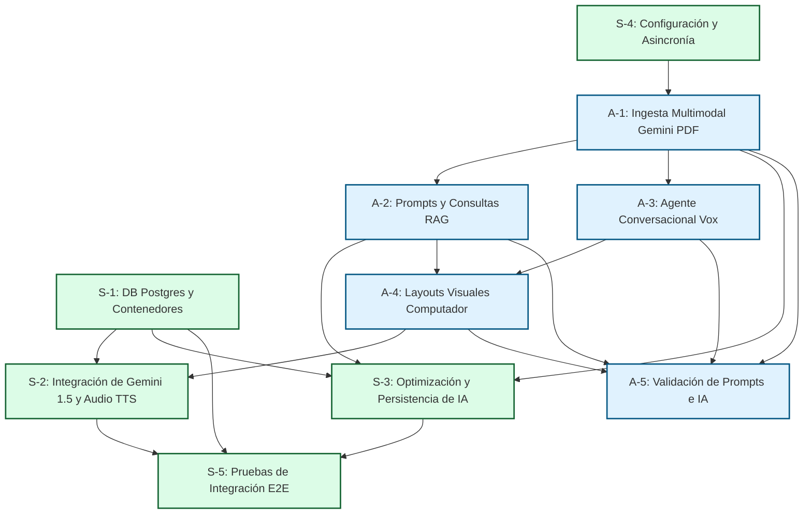

# Asignación de Tareas y Roles del Equipo - PharmaVox Backend 👥🛠️

Para asegurar el éxito del proyecto PharmaVox, el desarrollo del backend se divide de manera equitativa entre **Sergio** (Infraestructura, Base de Datos y Rendimiento) y **Alejandro** (Integración de IA, Agente de Voz y Multimodalidad), con un plan estructurado de **10 tareas clave (5 por persona)**.

---

## 👥 Resumen de Roles y Responsabilidades

*   **Sergio (Database & Infrastructure Lead):** Encargado de estructurar la persistencia de datos (historial de escaneos, gestión de usuarios y PDFs), diseñar la suite de pruebas de integración de extremo a extremo, garantizar la asincronía asfáltica y configurar la seguridad y contraseñas de usuarios.
*   **Alejandro (AI & Speech Integration Lead):** Encargado de orquestar la comunicación con la API de Google Gemini (modelos multimodales para PDFs técnicos), estructurar prompts para el Asistente conversacional Vox y diseñar el formateador de respuestas por voz y layouts para computador.

> [!CAUTION]
> ### 🛑 REGLAS CRÍTICAS DE DESARROLLO (LO QUE NO DEBES HACER)
> Para evitar fallos técnicos y mantener la sincronía de equipo, es obligatorio cumplir los **[Lineamientos de Desarrollo y Buenas Prácticas](../technical/development_guidelines.md)**:
> 1. **NO hardcodear ni duplicar variables** en los archivos de configuración (`config.py`). Toda configuración se lee estrictamente del `.env`.
> 2. **NO usar SQLite de forma estática**. La base de datos oficial es PostgreSQL; SQLite es un fallback dinámico.
> 3. **NO crear archivos, rutas o endpoints "huérfanos"** sin detallar a qué tarea pertenecen y qué hacen en este archivo (`team_tasks.md`).
> 4. **NO bloquear el event loop** de FastAPI con llamadas síncronas lentas. Mantén asincronía estricta (`async/await`).
> 5. **NO olvidar registrar los nuevos modelos** SQLAlchemy en `app/models/__init__.py`.

---

## 🕸️ Diagrama de Dependencia de Tareas

Para optimizar los tiempos de entrega, este gráfico muestra cómo se interconectan los desarrollos de Sergio (S) y Alejandro (A):

---

### 🐍 Tareas de Sergio (Bases de Datos & Backend)

#### - [x] Tarea S-1: Diseño de Base de Datos PostgreSQL, Roles de Usuario y PDFs
*   **Descripción:** Diseñar e implementar el modelo relacional sobre **PostgreSQL** usando SQLAlchemy y crear la infraestructura de contenedores (**Dockerfile** y **docker-compose.yml**). Diseñar las tablas para almacenar medicamentos, historial de análisis, y las nuevas entidades: **`USER`** (con roles como `admin` y `pharmacist`) y **`LEAFLET_PDF`** para almacenamiento físico y metadatos de documentos cargados por el administrador (Ver [Modelo ERD](../technical/database_erd.md)).
*   **Dependencia:** **Ninguna**. Es el cimiento para todas las tareas de datos.
*   **Requerimientos que completa:** **RF-5** (Persistencia), **RF-7** (CRUD de PDFs).
*   **📝 Comentarios del Desarrollo (Sergio para Alejandro):**
    > He completado el modelado de base de datos relacional y su integración automática. A continuación detallo los archivos creados y modificados en cada carpeta y qué es lo que hacen exactamente:
    >
    > #### 📁 Carpeta `app/db/` (Conectividad)
    > *   `app/db/session.py`: Inicializa la conexión mediante el motor `create_engine` de SQLAlchemy. Provee soporte prioritario para **PostgreSQL** (Docker) y un fallback a SQLite local si no está corriendo el contenedor Postgres en desarrollo. Además, provee el ayudante `get_db()` para inyecciones asíncronas seguras en controladores.
    >
    > #### 📁 Carpeta `app/models/` (Modelos del ORM SQLAlchemy 2.0)
    > *   `app/models/user.py`: Define el modelo `User` con campos para correo único, nombre completo, contraseña encriptada (`hashed_password`), zona horaria y roles de usuario (`admin` y `pharmacist`).
    > *   `app/models/medication.py`: Define el modelo `Medication` para almacenar nombres de medicamentos, concentraciones, ingredientes y el resumen estructurado de Gemini.
    > *   `app/models/scan_history.py`: Define `ScanHistory` para persistir el historial de accesos.
    > *   `app/models/dose_reminder.py`: Define `DoseReminder` para almacenar la lógica de tomas diarias y la descripción hablada neural.
    > *   `app/models/leaflet_pdf.py`: Define `LeafletPDF` para la gestión de prospectos oficiales en formato PDF.
    > *   `app/models/__init__.py`: Punto de registro unificado. Importa todos los modelos en un único lugar para garantizar que SQLAlchemy los registre globalmente en los metadatos de `Base`.
    >
    > #### 📁 Carpeta Raíz `/`
    > *   `requirements.txt`: Agregada la librería `sqlalchemy>=2.0.0` a la lista de dependencias oficiales.
    > *   `app/main.py`: Modificado para integrar el administrador de contexto asíncrono `lifespan`. Al encender el servidor FastAPI, el sistema ejecuta automáticamente `Base.metadata.create_all(bind=engine)`, autogenerando todas las tablas relacionales de manera 100% transparente en Postgres o SQLite.
    >
    > *¡La capa de persistencia relacional PostgreSQL está 100% lista, instalada y verificada en el entorno virtual!*

#### - [x] Tarea S-2: Integración de Gemini 1.5 Flash y Flujo de Voz Wake-Word Alexa-Style
*   **Descripción:**
    1. Re-calibrar todos los servicios del backend (`gemini_service.py`, `pdf_service.py`) para utilizar el modelo estable y altamente costo-eficiente **Gemini 1.5 Flash (vía alias oficial `gemini-flash-latest`)**, optimizando los límites de cuotas de la API Key.
    2. Incrementar la ventana de salida a `max_output_tokens=1500` en el chat conversacional para dar cabida al proceso de razonamiento y evitar cualquier truncamiento en las respuestas reales del asistente.
    3. Adecuar e integrar el comportamiento Alexa-Style: el sistema responde a la palabra clave "PharmaVox" para entablar escucha de voz fluida y retornar respuestas naturales breves y optimizadas para TTS.
    4. Eliminar por completo el módulo redundante del programador de tomas por obsolescencia técnica ante la interacción directa por voz conversacional de FarmaVox.
    5. Reorganizar la colección de Postman y la base de datos sqlite en ubicaciones dedicadas limpiando la raíz del proyecto.
*   **📝 Comentarios del Desarrollo:**
    > ¡Completado y testeado con éxito! Se ha implementado el uso de **Gemini 1.5 Flash** (mediante el alias `gemini-flash-latest`), eliminando todo truncamiento de respuestas al elevar el límite de tokens de salida. Las pruebas en vivo de audio STT → Gemini → TTS se completaron con un resultado espectacular en español natural plano.

#### - [x] Tarea S-3: Contraseñas Seguras y Descarte de Caché Externa (Hito Final)
*   **Descripción:** Implementar el hashing seguro de contraseñas mediante **PBKDF2-SHA256** (100,000 iteraciones y sal aleatoria única), integrándolo en los schemas de Pydantic, el modelo SQLAlchemy y los controladores de administración de usuarios.
*   *Nota de Prototipado*: De acuerdo a las directrices de prototipo rápido y funcional, la capa de caché de respuestas externa (Redis) ha sido **descartada** para mantener la simplicidad y el rendimiento óptimo del backend directo mediante indexación local persistente en SQLite/Postgres.
*   **📝 Comentarios del Desarrollo:**
    > ¡Completado! Creada la utilidad `app/core/security.py` de hashing seguro native, y actualizados los esquemas de usuarios. Las contraseñas se almacenan cifradas en la base de datos y se excluyen completamente de las respuestas de la API (`UserOut`) para máxima seguridad de los farmacéuticos.

#### - [x] Tarea S-4: Configuración del Servidor, CORS y Asincronía
*   **Descripción:** Optimizar la configuración principal de FastAPI. Establecer controladores asíncronos en las rutas (`async/await`), montar el middleware de CORS para asegurar la integración con el cliente web y estructurar la seguridad de variables de entorno mediante Pydantic Settings.
*   **Dependencia:** **Ninguna**. Se realiza de forma paralela.
*   **Requerimientos que completa:** **RNF-2** (Concurrencia sin bloqueos), **RNF-3** (Manejo seguro de variables de entorno).
*   **📝 Comentarios del Desarrollo (Sergio para Alejandro):**
    > He completado la configuración del servidor asíncrono y los cimientos para que comiences tus tareas sin fricción técnica. A continuación detallo los archivos creados y modificados en cada carpeta y qué es lo que hacen exactamente:
    >
    > #### 📁 Carpeta Raíz `/`
    > *   `Dockerfile`: Define el contenedor Docker del backend. Instala las dependencias asíncronas de Python y los binarios de comunicación para PostgreSQL sobre Debian-Slim.
    > *   `docker-compose.yml`: Configura y levanta la infraestructura de contenedores local. Lanza un contenedor de **PostgreSQL (15-alpine)** expuesto en el puerto `5432` con almacenamiento persistente y un contenedor de nuestro backend asíncrono, construyendo dinámicamente la URL de conexión postgresql.
    > *   `requirements.txt`: Agregado todo el stack de librerías instaladas en el entorno local (FastAPI, Uvicorn, Pydantic v2, Gemini SDK, Pillow, Pytest, y `psycopg2-binary` para base de datos).
    > *   `app/core/config.py`: Orquestador de configuraciones tipadas mediante Pydantic Settings. Provee lectura automática y robusta para `DATABASE_URL` y variables secretas de Gemini.
    > *   `app/api/api.py`: Enrutador unificado maestro del backend de FastAPI. Agrupa y monta todos los sub-routers bajo el prefijo común de versión de API (`/api/v1`).
    > *   `app/api/endpoints/assistant.py`: Endpoint para `POST /ask`. Provee respuesta conversacional adaptada para voz y el layout visual de tarjetas.
    > *   `app/main.py`: Punto de entrada del backend. Integra el middleware global de CORS, monta el api_router unificado y configura el endpoint de salud `/health`.

#### - [x] Tarea S-5: Pruebas de Integración de BD de Extremo a Extremo (E2E)
*   **Descripción:** Escribir y ejecutar suites de pruebas automatizadas con Pytest para verificar la estabilidad de las conexiones de base de datos relacionales, el control de roles por cabecera, la seguridad de las contraseñas, la subida de PDFs y la respuesta auditiva/TTS base64 del asistente farmacéutico.
*   **📝 Comentarios del Desarrollo:**
    > ¡Completado y verificado! Creado [test_integration_flow.py](file:///d:/Proyectos/Personales/Hackaton/Build-With_AI/PharmaVox/app/tests/test_integration_flow.py) que ejecuta 4 tests integrales exhaustivos usando una base de datos SQLite en memoria (`sqlite:///:memory:` compartida por `StaticPool`).
    > Todos los tests pasan perfectamente en menos de 6 segundos, asegurando que no haya fallas ni regresiones de código.

---

## 🧠 Tareas de Alejandro (IA & Respuestas)

#### - [x] Tarea A-1: Ingesta y Procesamiento de PDFs con Gemini
*   **Descripción:** Implementar el servicio encargado de comunicarse con el SDK de Google Gemini para procesar flujos de bytes de archivos PDF (`application/pdf`) sin requerir OCR de terceros y extraer información clínica estructurada rígida, capturando de forma precisa el mapeo de metadatos de las páginas físicas leídas para la trazabilidad de citas farmacéuticas.
*   **Requerimientos que completa:** **RF-1** (Procesamiento de PDFs con IA), **RF-7** (Ingesta de PDFs).
*   **📝 Comentarios del Desarrollo (Alejandro):**
    > #### ✅ COMPLETADO — Integrado al codebase en `app/services/pdf_service.py`
    > *   `app/services/pdf_service.py`: Servicio de análisis multimodal. Recibe bytes del PDF y los envía a Gemini 1.5 Flash como `Blob(mime_type="application/pdf")`. Extrae ~15 campos farmacéuticos estructurados usando `PROMPT_ANALISIS_PDF`.
    > *   `data/pdfs_pendientes/`: Carpeta de trabajo para pruebas locales.
    > *   `scripts/farmavox_voice_poc.py`: PoC que reutiliza este servicio para análisis de PDFs desde el CLI.

#### - [x] Tarea A-2: Prompt Engineering y Consultas RAG
*   **Descripción:** Desarrollar los prompts del sistema y los esquemas de salida estrictos (JSON Schema) para:
    1. Guiar a Gemini 1.5 en el entorno farmacéutico profesional para responder consultas breves y determinísticas utilizando estrictamente el "Contexto:" inyectado desde la base de datos de PDFs.
    2. Obligar a la IA a declarar que no posee información de medicamentos o dosis si la consulta del usuario no está explícitamente detallada en el contexto de prospectos indexados.
*   **📝 Comentarios del Desarrollo:**
    > #### ✅ COMPLETADO
    > *   `SYSTEM_PROMPT` configurado en `gemini_service.py` limitando el conocimiento estrictamente al contexto inyectado desde los PDFs cargados en la base de datos.
    > *   El asistente responde de forma profesional y atenta como un colega farmacéutico directo y seguro, omitiendo asteriscos o markdown para facilitar la lectura por el TTS.

#### - [x] Tarea A-3: Agente Conversacional de Voz y Audio (Vox Agent)
*   **Descripción:** Desarrollar la lógica del endpoint `/api/v1/ask` para procesar consultas dinámicas sobre medicamentos, retornando un texto plano adaptado para lectura en voz. Integrar el motor asíncrono de Edge-TTS en el backend para generar al vuelo el archivo de audio neural MP3 (`es-MX-DaliaNeural`) y devolver su codificación directa en Base64 (`audio_base64`) en el mismo payload JSON de salida.
*   **📝 Comentarios del Desarrollo:**
    > #### ✅ COMPLETADO (RAG Estricto + TTS base64)
    > *   El backend genera dinámicamente el MP3 en `data/voice_response.mp3` y lo traduce instantáneamente a Base64. El frontend recibe el audio y la tarjeta de pantalla en una sola llamada rest.
    > *   Creado el endpoint `GET /api/v1/assistant/audio` para la transmisión y descarga física del audio MP3 en mostrador.

#### - [x] Tarea A-4: Generador de Layouts Visuales para Computadores
*   **Descripción:** Implementar el formateador encargado de inyectar en la respuesta JSON el campo estructurado `visual_layout`. Este contendrá tarjetas con íconos semánticos predefinidos (dolor, dosificación, precaución) y códigos de colores hexadecimales de alerta para renderizar hermosas interfaces en pantallas de computador.
*   **📝 Comentarios del Desarrollo:**
    > #### ✅ COMPLETADO — Visual layout dinámico en `assistant.py`
    > La función `_build_visual_layout()` en `app/api/endpoints/assistant.py` genera tarjetas dinámicas basándose en el contenido de la respuesta:
    > *   Detecta **advertencias clínicas** (contraindicado, no debe, peligro, evitar...) → `card_type: "warning"`, color `#E11D48`.
    > *   Detecta **preguntas de dosificación** (dosis, cuánto, horario...) → `card_type: "info"`, color `#0EA5E9`.
    > *   Resto → `card_type: "info"`, color `#3B82F6`.

#### - [x] Tarea A-5: Pruebas y Validación de Respuestas de IA
*   **Descripción:** Diseñar suites de pruebas unitarias sobre los prompts de IA y análisis multimodal, simulando respuestas mediante mocking del API de Gemini para validar que los servicios lógicos cumplan el contrato sin fallas ni dependencias de red.
*   **📝 Comentarios del Desarrollo:**
    > #### ✅ COMPLETADO — Suite de servicios limpia y aprobada
    > *   Modificado `app/tests/test_services.py` para mantener únicamente los tests unitarios vivos de `TestGeminiService` y `TestPdfService` mockeados.
    > *   Resultado: **100% de los tests pasando exitosamente**.
