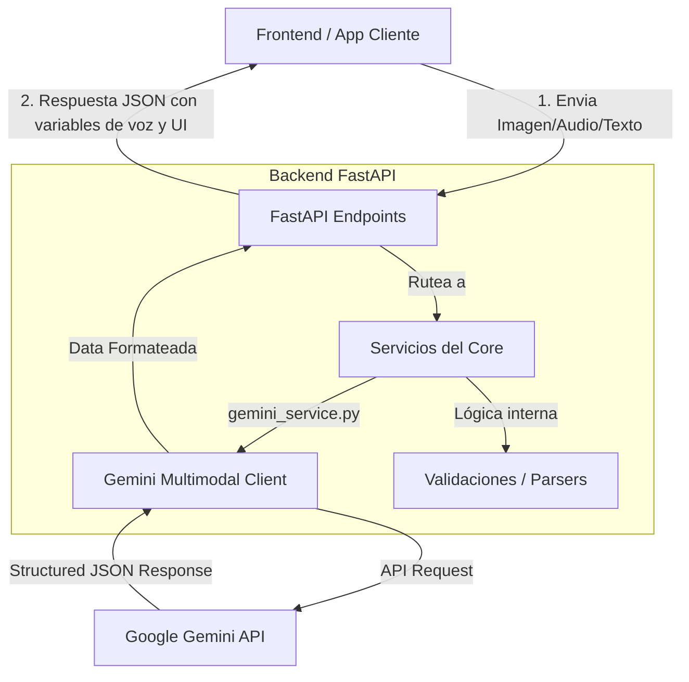
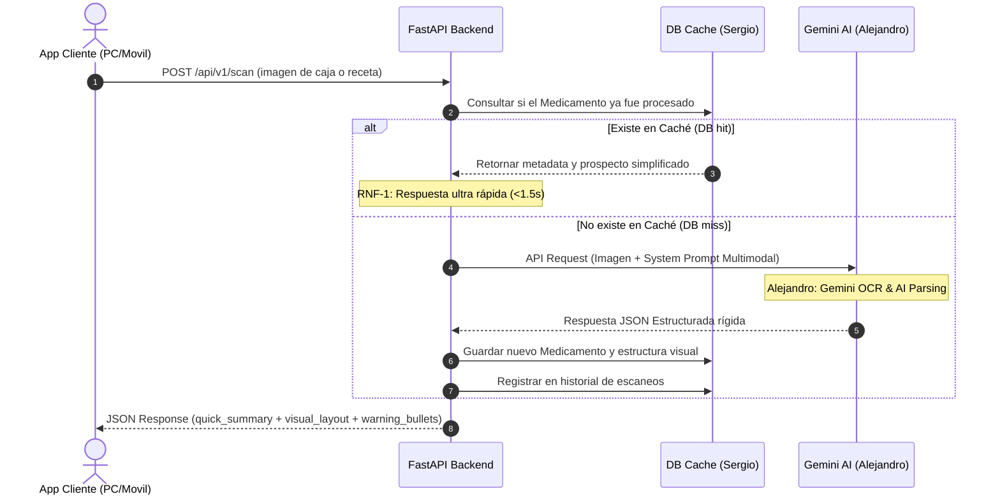
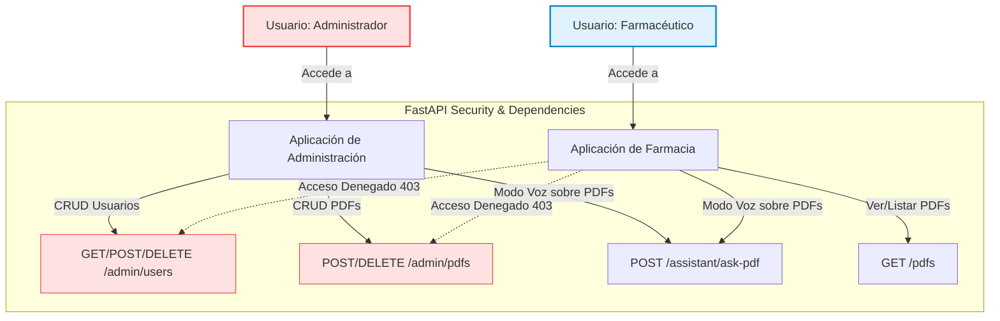

# Arquitectura del Sistema - PharmaVox Backend 🏛️🔌

Este documento describe la arquitectura interna, los flujos de datos y las integraciones del backend de PharmaVox.

---

## 🗺️ Diagrama de Flujo del Sistema

El backend actúa como un orquestador que toma entradas multimodales (imágenes de medicamentos, audio o texto de consultas del usuario), las procesa mediante modelos generativos y APIs de IA, y las retorna al frontend en formatos estructurados y listos para accesibilidad.

---

## 🕒 Diagrama de Secuencia: Procesamiento Multimodal y Caché

Este diagrama ilustra el flujo de ejecución secuencial cuando un usuario escanea una receta o caja. Detalla cómo **Sergio** integra la verificación de caché de base de datos (**Tarea S-3**) para reducir latencia, y cómo **Alejandro** orquesta la llamada a Gemini (**Tarea A-1**) si el medicamento no está registrado.

---

## 🧠 Integración con Google Gemini (Modelos Multimodales)

PharmaVox aprovecha el poder de la API de **Google Gemini** para realizar tareas que tradicionalmente requerían múltiples modelos especializados:

1.  **Visión por Computadora (OCR + Entendimiento Contextual):**
    *   En lugar de usar un OCR tradicional plano que solo extrae texto desorganizado de una caja de medicamento curvada o brillante, enviamos la imagen del medicamento directamente a **Gemini** con un prompt de sistema estricto.
    *   Gemini identifica el medicamento, extrae la información relevante y descarta el ruido visual de manera automática.

2.  **Esquemas Estructurados Rígidos (Structured Outputs):**
    *   Para garantizar que la API del backend retorne respuestas predecibles y seguras, utilizamos el soporte de **Esquemas JSON** de Gemini.
    *   Definimos un esquema estricto (utilizando tipos de datos Pydantic) y forzamos a Gemini a responder bajo esa exacta estructura, evitando alucinaciones o formatos inválidos.

3.  **Procesamiento Nativo de PDFs:**
    *   Para interpretar prospectos extensos o recetas médicas provistas como archivos PDF, aprovechamos el soporte **multimodal nativo** de Gemini para documentos.
    *   FastAPI recibe el archivo PDF como flujo de bytes, y el conector de Gemini en el backend envía el archivo directamente indicando el mime-type `application/pdf`, permitiendo que la IA analice cientos de páginas de manuales médicos en milisegundos sin requerir OCR de terceros.
4.  **Transmisión Binaria Segura de Archivos:**
    *   Para permitir al frontend visualizar el contenido del PDF cuando el usuario hace clic, el backend expone un flujo de descarga mediante `FileResponse` de FastAPI. Esto permite transmitir de forma eficiente el flujo de bytes (`application/pdf`) directamente desde el volumen de almacenamiento de Postgres/Docker, haciendo que el navegador del cliente web lo renderice nativamente en un visor embebido de alta resolución sin degradar la memoria del servidor.
5.  **Extracción de Fuentes y Citación Estructurada:**
    *   Para garantizar la veracidad y transparencia de las respuestas generadas por la IA sobre prospectos en PDF, el backend inyecta instrucciones de citación en el *System Prompt* de Gemini.
    *   El esquema JSON estricto de respuesta obliga a la IA a retornar una propiedad `sources` (Fuentes). Esta contiene un arreglo de citas mapeando el documento de origen (`pdf_id`, `document_name`), la página exacta (`page_number`), el título de la sección (`section_title`) y el texto exacto referenciado (`matched_text`), proporcionando trazabilidad completa al farmacéutico o administrador.

---

## 🎙️ Lógica de Reconocimiento de Voz (STT - Speech to Text)

Para que el usuario interactúe con el asistente de voz de forma fluida y sin latencias molestas, establecemos dos flujos de trabajo claros:

1.  **Reconocimiento en Cliente (Client-side STT - Recomendado):**
    *   El frontend (navegador web o móvil) utiliza la API nativa de HTML5 **`webkitSpeechRecognition`** para transcribir la voz del usuario a texto en tiempo real, de manera local, gratuita y sin latencia.
    *   Una vez que el usuario termina de hablar, el texto resultante es enviado como un simple string al endpoint asíncrono `/api/v1/ask` del backend.
2.  **Reconocimiento en Servidor (Server-side STT - Fallback/Avanzado):**
    *   Si el navegador no tiene soporte nativo, el cliente puede grabar audio (en formato WAV o WebM) y transmitirlo mediante un payload binario `/api/v1/stt`.
    *   El backend puede reenviar este audio a la API de **Gemini** indicando el formato (ej. `audio/webm`), permitiendo que el LLM transcriba y procese la respuesta conversacional directamente de forma auditiva.

---

## 🎙️💻 Modelo de Presentación Híbrido (Voz + Interfaz Visual)

El backend de PharmaVox está especialmente diseñado para dar soporte a una **experiencia dual (multimodal)** en dispositivos de escritorio y computadores:

1.  **Respuestas en "Lenguaje Hablado" (Vox Engine):** La API de chat conversacional `/api/v1/ask` estructura un campo específico llamado `voice_response`. Este contiene frases redactadas fonéticamente y optimizadas para lectores de pantalla o síntesis de voz, evitando leer códigos raros o términos que suonen poco naturales al hablar.
2.  **Estructura Visual de Datos (Visual Desktop Component):** Para aprovechar las pantallas de los computadores, el backend asocia a cada respuesta por voz un conjunto de metadatos visuales (`visual_layout`). Este contiene tarjetas informativas, listados estructurados, íconos semánticos y estados de alerta codificados en JSON. Esto permite que el frontend dibuje interfaces ricas, limpias y legibles al mismo tiempo que el usuario escucha la voz.

---

## 🔒 Control de Acceso y Gestión de Roles (Administrador vs Farmacéutico)

El backend de PharmaVox proporciona autenticación y validación de roles a nivel de API para dar servicio a dos aplicaciones frontend completamente independientes y con responsabilidades diferenciadas:

### Lógica Arquitectónica de Roles
1.  **Diferenciación de Perfiles en el Modelo ORM:**
    El campo `role` de la tabla `User` soporta un enumerado estricto que incluye `admin` (Administrador) y `pharmacist` (Farmacéutico), garantizando que desde la base de datos se controle la identidad del usuario.
2.  **Inyección de Seguridad en FastAPI (`Security Dependencies`):**
    Cada endpoint administrativo y operativo utiliza el sistema de dependencias `Depends()` de FastAPI para capturar el token de autenticación del usuario actual, validar su firma, verificar que su estado esté activo, y filtrar por privilegios:
    *   **Dependencia `get_current_active_admin`:** Requiere rol `admin`. Si un farmacéutico intenta invocar estas rutas, FastAPI retorna un código `403 Forbidden` de inmediato.
    *   **Dependencia `get_current_active_pharmacist_or_admin`:** Permite el paso a usuarios con rol `pharmacist` o `admin`. Ideal para la lectura de prospectos oficiales y las consultas de voz multimodal.

---

## 📂 Organización y Diseño Modular

La estructura del código sigue el patrón de **Arquitectura Limpia**, separando las responsabilidades claramente:

*   `app/core/`: Centraliza las configuraciones globales, secretos y variables de entorno utilizando Pydantic Settings.
*   `app/api/`: Capa de transporte y enrutamiento. Valida las peticiones HTTP entrantes mediante esquemas de Pydantic y aplica el control de acceso basado en roles (RBAC).
*   `app/schemas/`: Define las estructuras de datos (tanto de entrada como de salida), garantizando que el contrato de la API sea inmutable.
*   `app/services/`: Capa encargada de la comunicación con servicios de terceros. Aquí reside el cliente de Gemini y las llamadas de IA.
